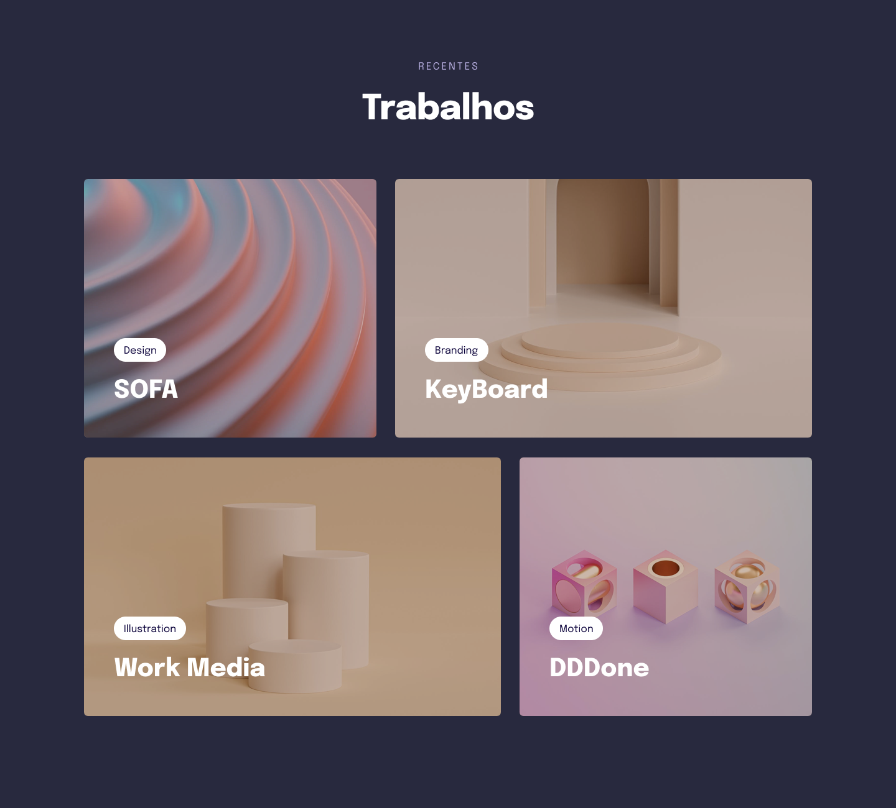

<h1 align="center">Explorer -  Projeto 05 </h1>

  <a href="#-tecnologias">Tecnologias</a>&nbsp;&nbsp;&nbsp;|&nbsp;&nbsp;&nbsp;
  <a href="#-projeto">Projeto</a>&nbsp;&nbsp;&nbsp;|&nbsp;&nbsp;&nbsp;
  <a href="#-layout">Layout</a>&nbsp;&nbsp;&nbsp;|&nbsp;&nbsp;&nbsp;
  <a href="#memo-licença">Licença</a>

  

 

  

## 🚀 Tecnologias

Esse projeto foi desenvolvido com as seguintes tecnologias:

- HTML e CSS
- Git e Github
- Figma

## 💻 Projeto

O projeto 05 é a criação de uma Land-page básica para aplicar os conceitos de  CSS Grid e responsividades.

## 🔖 Layout

Você pode visualizar o layout do projeto através [DESSE LINK](https://www.figma.com/file/FNXn9adHGCyjgmDcvL6gMG/Explorer-Stage-03-Projeto-03-(Copy)?type=design&node-id=203-1865&mode=design&t=bx66TYXULMzAkmBB-0). É necessário ter conta no [Figma](https://figma.com) para acessá-lo.

## :memo: Licença

Esse projeto está sob a licença MIT.

---

Developed by Jeferson    
:wave: [Participe da comunidade da RocketSeat!](https://discord.gg/rocketseat)
